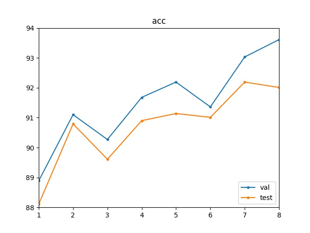
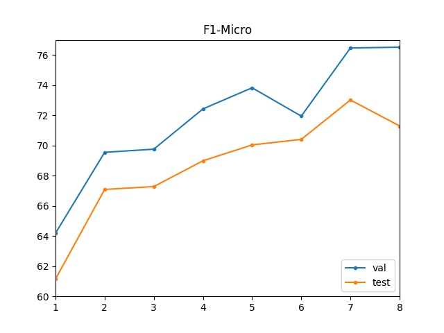

# emoContext
    SemEval 2019 task 3
## Requirements
    1. TensorFlow >= 1.10
    2. TensorFlow Hub
    3. tqdm
    4. sklearn
    5. nltk
    
## Commandline Options

    Please read models/train.py for details.

## Example Usage
    
    python3 main.py --universal --model hbmp+share --nLSTM 3 --hiddenSize 500 --dropOut 0.6 --preEmbedding --elmo --trainElmo --learningRate 0.001 --rnnLayers 1 --batchSize 100 --epochs 80

## Model Iteration

**Acc**   |  **F1-Micro** 
:-------------------------:|:-------------------------:
  |  

    1. full model - weighted - elmo - glove - speaker embeddings - universal sentence encoder - new data - emoji2text”
    2. full model - weighted - elmo - glove - speaker embeddings - universal sentence encoder - new data
    3. full model - weighted - elmo - glove - speaker embeddings - universal sentence encoder
    4. full model - weighted - elmo - glove - speaker embeddings
    5. full model - weighted - elmo - glove
    6. full model - weighted - elmo
    7. full model - weighted
    8. full model

## Contact
    Author: Zhao Meng
    Email: zhmeng@student.ethz.ch
